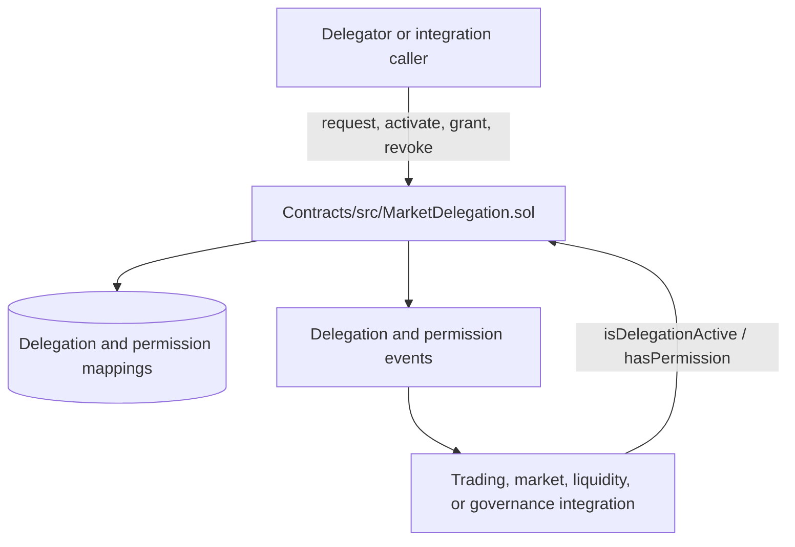

# MarketDelegation implementation status

This document is a verification note for the MarketDelegation work associated
with Phase 2, P2-094. It describes the repository as it exists today; it does
not claim deployment or successful test execution without evidence.

## Architecture



`MarketDelegation` is a standalone Solidity contract. The repository does not
currently wire it into the Nest API or a frontend flow. Integrations must call
the contract explicitly and enforce the returned status and permission.

## Source of truth

- Contract: [Contracts/src/MarketDelegation.sol](Contracts/src/MarketDelegation.sol)
- Contract API: [Contracts/MARKET_DELEGATION_API_REFERENCE.md](Contracts/MARKET_DELEGATION_API_REFERENCE.md)
- Quick reference: [Contracts/MARKET_DELEGATION_QUICK_REFERENCE.md](Contracts/MARKET_DELEGATION_QUICK_REFERENCE.md)
- Implementation summary: [Contracts/MARKET_DELEGATION_IMPLEMENTATION_SUMMARY.md](Contracts/MARKET_DELEGATION_IMPLEMENTATION_SUMMARY.md)
- Foundry configuration: [Contracts/foundry.toml](Contracts/foundry.toml)

The contract supports delegation request, activation, revocation, permission
grant/revoke, expiration, and read-only query functions. Its constructor uses
OpenZeppelin `Ownable(msg.sender)` and `ReentrancyGuard`.

## Verification commands

Run these commands from a clean checkout:

```bash
cd Contracts
forge build
forge test
```

The Foundry project is configured with `src = "src"` and `test = "test"`.
The root [test/MarketDelegation.t.sol](test/MarketDelegation.t.sol) is a legacy
test location and is not included by the current `Contracts/foundry.toml`.
Do not report those root tests as passing unless they are run explicitly with
an appropriate configuration.

## Verification status

The contract source and documentation are present. Test execution and security
review remain separate verification activities. Deployment addresses,
frontend/API integration, and production readiness are not established by this
document.

## Phase ownership

This is Phase 2 core market wiring documentation. The Solidity implementation
is owned by the `Contracts/` Foundry project; API and UI integrations are
follow-up work in `Backend/` and `Frontend/` respectively.
