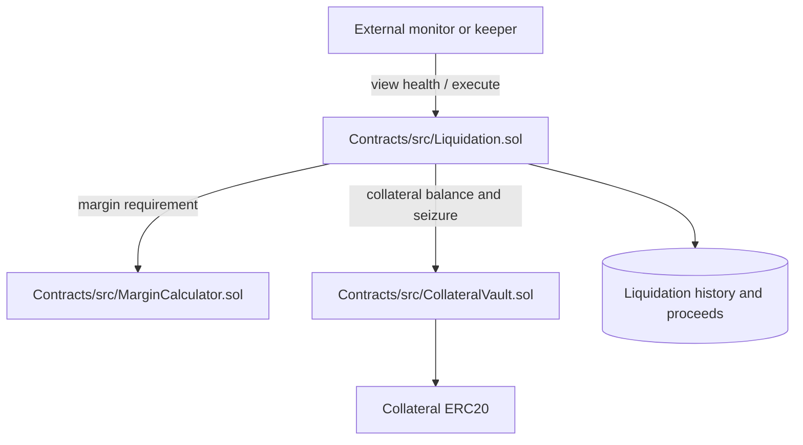

# Liquidation implementation and API contract

This document covers the Phase 2 liquidation contract surface. It separates
the Solidity prototype from the unrelated legacy JavaScript service so callers
do not assume that either path is production-ready or automatically connected.

## Ownership and architecture



**Phase 2 ownership:** the on-chain implementation belongs to `Contracts/`.
The Nest backend has a separate legacy liquidation service under
`Backend/services/` and a monitor job under `Backend/jobs/`; those files are
not an adapter for the Solidity contract. Frontend wiring and deployment
configuration are follow-up integration work.

## Solidity API

Implementation: [Contracts/src/Liquidation.sol](Contracts/src/Liquidation.sol)

### Constructor

```solidity
constructor(
    address _collateralVault,
    address _marginCalculator,
    uint256 _liquidationPenaltyBps,
    uint256 _liquidatorRewardBps
)
```

The vault and margin calculator addresses must be non-zero. Penalty and reward
values are basis points and are validated against the contract constants.

### Administration

```solidity
registerMarket(address market, address collateralToken, address priceOracle)
updatePenaltyParameters(uint256 liquidationPenaltyBps, uint256 liquidatorRewardBps)
setPaused(bool paused)
withdrawProtocolProceeds(address token, address recipient, uint256 amount)
```

These functions are owner-only where enforced by the contract. A market must
be registered before position liquidation can use its collateral token and
oracle configuration.

### Monitoring and execution

```solidity
monitorLiquidationCondition(address account, address market)
batchMonitorConditions(address[] calldata accounts, address market)
isPositionLiquidatable(address account, address market)
executeLiquidation(address account, address market)
```

`executeLiquidation` is state-changing and protected by pause and reentrancy
guards. Callers should first inspect the returned condition or handle custom
errors such as `PositionHealthy`, `MarketNotRegistered`, and
`InsufficientCollateral`.

### Calculations and queries

```solidity
calculateLiquidationPenalty(uint256 collateralValue, uint256 debtValue)
getHealthFactor(address account, address market)
getLiquidationHistory(address account, address market)
getMarketProceeds(address market)
getProtocolProceeds(address token)
```

Amounts use the token's unit; health factors use 18-decimal fixed-point
values, where `1e18` represents 1.0.

## Environment and ports

The Solidity contract itself has no environment variables or listening port.
For local backend integration, use [Backend/.env.example](Backend/.env.example):

| Setting | Value | Owner |
| --- | --- | --- |
| `PORT` | `4000` | Nest API |
| `MONGODB_URI` | `mongodb://127.0.0.1:27017/gatedelay` | Backend persistence |
| `REDIS_URL` | `redis://127.0.0.1:6379` | Backend workers/cache |
| `RPC_URL` | `http://127.0.0.1:8545` | Local chain access |
| `BLOCKCHAIN_RPC_URL` | `https://rpc.mantle.xyz` | Mantle/oracle access |

The frontend uses [Frontend/.env.example](Frontend/.env.example):

| Setting | Value | Owner |
| --- | --- | --- |
| `NEXT_PUBLIC_API_URL` | `http://localhost:4000/api` | Browser API proxy target |
| `NEXT_PUBLIC_BACKEND_URL` | `http://localhost:4000` | Browser/socket backend target |
| `NEXT_PUBLIC_MARKET_MAKER_ADDRESS` | empty by default | Deployed contract address |

The local Hardhat RPC, when used, is `http://127.0.0.1:8545` as configured in
[Frontend/localnet/hardhat.config.js](Frontend/localnet/hardhat.config.js).

## Verification

From a clean checkout:

```bash
cd Contracts
forge build
forge test
```

The repository contains a root [test/Liquidation.t.sol](test/Liquidation.t.sol),
but the current `Contracts/foundry.toml` configures `Contracts/test` as the
default test directory. Do not claim the root suite passed unless it is run
explicitly with a configuration that includes it.

## Legacy backend boundary

The JavaScript service documentation in [Backend/LIQUIDATION.md](Backend/LIQUIDATION.md)
describes a different service API and contains historical production claims.
Use the actual service implementation and backend setup before wiring it to
the Solidity contract; no automatic bridge is currently documented here.
