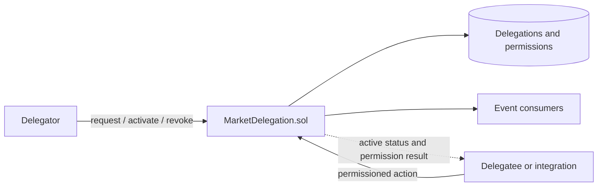

# MarketDelegation verification checklist

Scope: Phase 2 core market wiring, P2-124. This checklist records what exists
in the repository and the checks a contributor should run before integration.

## Architecture



The contract is a standalone permission registry. It does not automatically
authorize actions in `MarketMaker`, `MarketFactory`, the backend, or the
frontend; each integration must check its status and permission.

## Contract checklist

- [x] Delegation lifecycle: `PENDING`, `ACTIVE`, `REVOKED`, `EXPIRED`
- [x] Market-specific and global scope (`marketId = 0`)
- [x] Time-limited delegations
- [x] Permissions: `TRADE`, `CREATE_MARKET`, `RESOLVE_MARKET`,
  `MANAGE_LIQUIDITY`, `ADMIN`
- [x] Permission grant, batch grant, and revoke operations
- [x] Queries by delegation ID, delegator, delegatee, and market
- [x] Custom errors and event emission
- [x] Reentrancy protection and owner-only emergency expiration

## Files

- Implementation: [Contracts/src/MarketDelegation.sol](Contracts/src/MarketDelegation.sol)
- API reference: [Contracts/MARKET_DELEGATION_API_REFERENCE.md](Contracts/MARKET_DELEGATION_API_REFERENCE.md)
- Quick reference: [Contracts/MARKET_DELEGATION_QUICK_REFERENCE.md](Contracts/MARKET_DELEGATION_QUICK_REFERENCE.md)
- Summary: [Contracts/MARKET_DELEGATION_IMPLEMENTATION_SUMMARY.md](Contracts/MARKET_DELEGATION_IMPLEMENTATION_SUMMARY.md)
- Foundry config: [Contracts/foundry.toml](Contracts/foundry.toml)
- Legacy root test: [test/MarketDelegation.t.sol](test/MarketDelegation.t.sol)

## Clean-checkout commands

```bash
cd Contracts
forge build
forge test
forge fmt --check
```

These commands use the current Foundry project configuration. The configured
test directory is `Contracts/test`; the root `test/MarketDelegation.t.sol` is
not part of the default test command.

## Verification boundaries

- Contract compilation and configured tests must be verified with Foundry.
- No deployment address is committed for this contract.
- No backend or frontend integration is implied by the contract existing.
- A code review or security audit is not equivalent to test execution.

## Phase ownership

The contract and Foundry checks belong to the `Contracts/` project in Phase 2.
Backend endpoints and frontend permission-aware workflows require separate
integration work.
