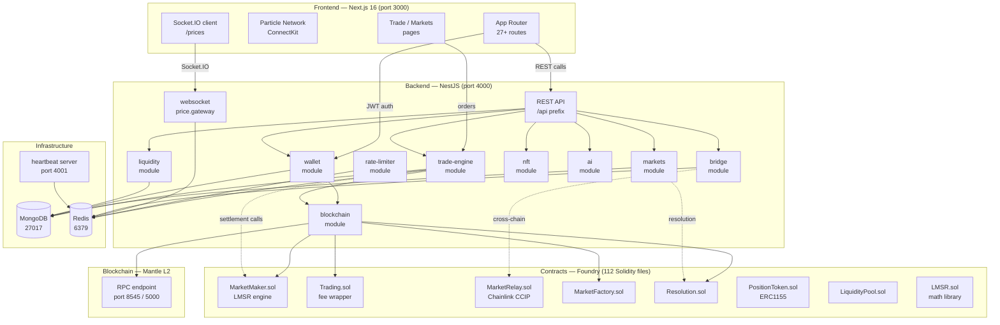

# GateDelay — Phase roadmap & issue index

High-level sequencing for collaborators. Each phase file contains **≥200** GitHub-ready issues.

## Current snapshot

| Area | Status |
|------|--------|
| **Trading model** | **Ambiguous** — LMSR (`Contracts/src/MarketMaker.sol`, `Contracts/src/Trading.sol`) and CLOB (`Contracts/src/OrderBook.sol`) both exist; see [ADR 0001](docs/adr/0001-lmsr-vs-clob-ambiguity.md). **[Phase 2](PHASE_2.md) decides.** |
| **Trading model** | **Ambiguous** — LMSR (`Contracts/src/MarketMaker.sol`, `Contracts/src/Trading.sol`) and CLOB (`Contracts/src/OrderBook.sol`) both exist; see [ADR 0001](docs/adr/0001-lmsr-vs-clob-ambiguity.md). **Phase 2 decides.** |
| Backends | NestJS modules under `Backend/src/` plus legacy Express `Backend/server.js` — single runtime path unified in **Phase 1** |
| Frontend | Next.js app under `Frontend/`; some market/trade UI still mock-driven — **Phase 3** completes surfaces |
| Contracts | Foundry project under `Contracts/` — wired end-to-end in **Phase 2**, hardened in **Phase 4** |

## Phase map

| Phase | File | Theme | Issues |
|-------|------|-------|--------|
| 1 | [PHASE_1.md](PHASE_1.md) | Stabilize foundations | ≥200 |
| 2 | [PHASE_2.md](PHASE_2.md) | Core market wiring | ≥200 |
| 3 | [PHASE_3.md](PHASE_3.md) | Product complete | ≥200 |
| 4 | [PHASE_4.md](PHASE_4.md) | Hardening | ≥200 |
| 5 | [PHASE_5.md](PHASE_5.md) | Deployment & shipping | ≥200 |

## Architecture diagram

The diagram below reflects the actual runtime components in `Backend/`, `Frontend/`, and `Contracts/`.



### Component summary

| Layer | Technology | Key paths |
|-------|-----------|-----------|
| **Frontend** | Next.js 16, React 19, Particle Network, Socket.IO | `Frontend/app/`, `Frontend/components/` |
| **Backend** | NestJS 11, Mongoose, Redis, ethers 6 | `Backend/src/` (47 NestJS modules) |
| **Contracts** | Solidity 0.8.28, Foundry, OpenZeppelin | `Contracts/src/` (112 contracts), `Contracts/test/` (90 tests) |
| **Infrastructure** | MongoDB, Redis | Default ports 27017, 6379 |

### Important data flows

1. **Wallet flow**: Frontend → Particle ConnectKit → Backend `wallet` module (EIP-1919 verification) → JWT issued → subsequent API calls authenticated.
2. **Trade flow**: Frontend trade page → Backend `trade-engine` module (price-time priority matching, MongoDB transactions) → real-time prices via Socket.IO `/prices` namespace → on-chain settlement via `blockchain` module → `MarketMaker.sol` / `Trading.sol`.
3. **Cross-chain flow**: Backend `bridge` module → `MarketRelay.sol` (Chainlink CCIP) → destination chain.
4. **Resolution flow**: Backend `markets` module (cron) → `Resolution.sol` → payout via `LiquidityPool.sol`.

## Phase dependencies

```text
Phase 1 (foundations)
    ↓
Phase 2 (core market wiring)
    ↓
Phase 3 (product complete)
    ↓
Phase 4 (hardening)
    ↓
Phase 5 (deployment & shipping)
```

- **Phase 1** must land before market wiring: broken boot paths block all later work.
- **Phase 2** depends on stable Backend/Contracts build; resolves LMSR vs CLOB (ADR 0001).
- **Phase 3** depends on live market data from Phase 2; replaces mocks in `Frontend/data/mockMarkets.ts`.
- **Phase 4** runs in parallel with late Phase 3 but must gate **Phase 5** production deploy.
- **Phase 5** assumes CI green, security sign-off, and staging validation from Phases 1–4.

## Labels

Apply these GitHub labels when filing issues from phase files:

| Label | Use for |
|-------|---------|
| `phase-1` … `phase-5` | Phase ownership (required) |
| `backend` | `Backend/` NestJS, Express, workers, migrations |
| `frontend` | `Frontend/` Next.js UI, hooks, components |
| `contracts` | `Contracts/`, `test/*.t.sol` Foundry |
| `docs` | README, ADRs, contributor docs |
| `ci` | GitHub Actions, build pipelines |
| `security` | Auth, access control, audits |
| `testing` | Unit, integration, e2e, fuzz |
| `infra` | Deploy, Docker, env, monitoring |
| `api` | REST/WebSocket public surfaces |
| `db` | Persistence, migrations, schemas |
| `foundations` | Phase 1 umbrella (optional) |
| `markets` | Phase 2 umbrella (optional) |
| `product` | Phase 3 umbrella (optional) |
| `hardening` | Phase 4 umbrella (optional) |
| `deployment` | Phase 5 umbrella (optional) |

## Filing GitHub issues

1. Pick a phase file ([PHASE_1.md](PHASE_1.md) … [PHASE_5.md](PHASE_5.md)).
2. Copy one issue block (from `### PN-XXX` through `**Related:**`).
3. Create a new GitHub issue; paste the block as the body.
4. Set the title to the `###` heading text (e.g. `P2-042: Wire MarketFactory to LMSR.sol`).
5. Add labels from `**Labels:**` (at minimum `phase-N` plus area label).
6. Link related PRs to the `**Related:**` path.

**Issue template format:**

```markdown
### PN-XXX: Title
**Labels:** `phase-N`, `<area>`
**Description:** …
**Acceptance criteria:**
- [ ] …
**Related:** `path`
```

## Architecture decisions

| ADR | Title | Status |
|-----|-------|--------|
| [0001](docs/adr/0001-lmsr-vs-clob-ambiguity.md) | LMSR vs CLOB / OrderBook ambiguity | Proposed — decision owned by [PHASE_2.md](PHASE_2.md) |

## Regenerating phase files

```bash
node _gen_phases.js
```

On Windows without Node: `powershell -ExecutionPolicy Bypass -File _gen_phases.ps1`

Generator scans `Backend/`, `Frontend/`, `Contracts/`, `test/`, and `docs/` for real paths.
